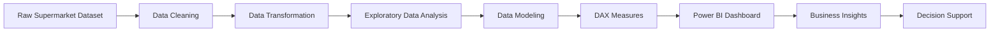
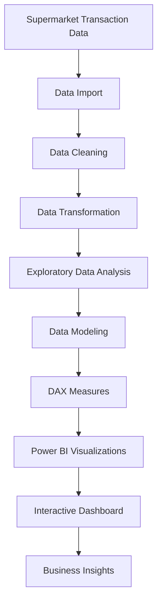
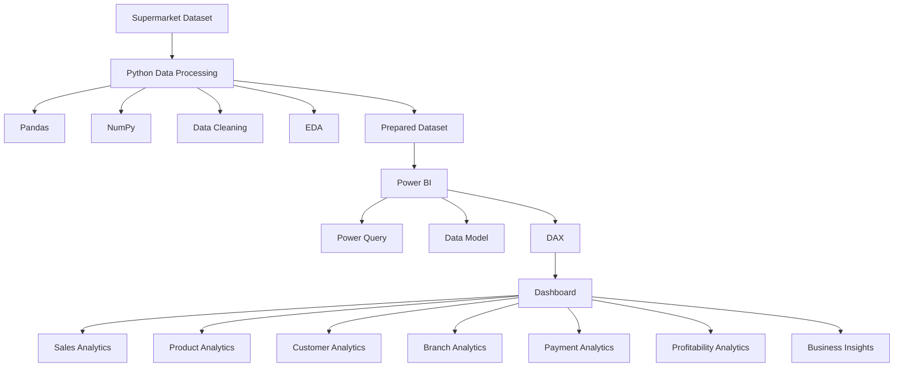
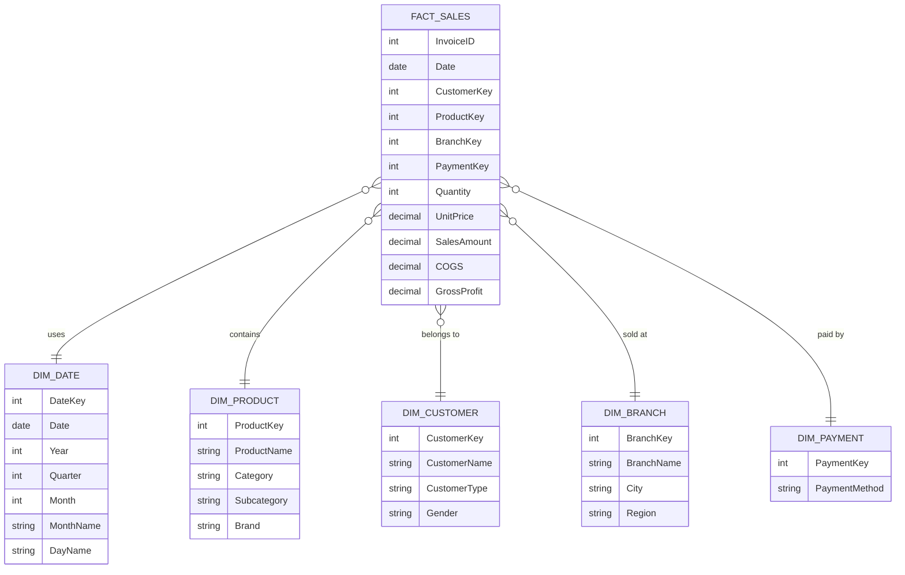
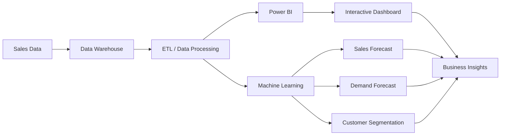

# 🛒 Supermarket Sales Analysis Dashboard

A complete **Supermarket Sales Analysis & Business Intelligence project** that transforms raw supermarket transaction data into meaningful insights using **Python-based data analysis and Microsoft Power BI**.

The project analyzes **sales, revenue, COGS, gross profit, gross margin, products, categories, branches, customers, invoices, payment channels, and transaction trends** through an interactive analytical dashboard.

---

## 📊 Project Overview

The **Supermarket Sales Analysis Dashboard** is designed to help understand supermarket business performance through data-driven analysis.

The project follows an end-to-end analytics workflow:



The dashboard provides an interactive way to explore supermarket performance using **KPIs, charts, tables, slicers, filters, and analytical visuals**.

---

# 🎯 Objectives

The main objectives of this project are:

* Analyze supermarket sales transactions.
* Understand overall revenue and sales performance.
* Calculate COGS and gross profit.
* Analyze gross profit margin.
* Analyze product and category performance.
* Compare branch performance.
* Analyze customer purchasing behavior.
* Analyze payment channels.
* Identify sales trends.
* Create interactive KPIs.
* Build a professional Power BI dashboard.
* Convert raw transactional data into meaningful business insights.

---

# 🚀 Key Features

## 💰 Sales Analysis

* Total Sales
* Total Revenue
* Monthly Sales
* Daily Sales
* Sales Growth
* Sales by Category
* Sales by Product
* Sales by Branch
* Sales by Customer
* Sales by Payment Method

## 📈 Profitability Analysis

* Total COGS
* Gross Profit
* Gross Margin
* Profit by Product
* Profit by Category
* Profit by Branch
* Profit Trend
* Profit Margin Analysis
* Sales vs Profit

## 🛍️ Product Analysis

* Product Category Contribution
* Top Products
* Bottom Products
* Product Revenue
* Product Quantity
* Product Profit
* Product Margin
* Category Performance
* Product Performance Matrix

## 🏢 Branch Analysis

* Branch Revenue
* Branch Invoices
* Branch Profit
* Average Basket
* Branch Ranking
* Branch Performance Matrix
* Branch × Category Analysis

## 👥 Customer Analysis

* Customer Count
* Customer Type
* Customer Spending
* Purchase Frequency
* Average Customer Spending
* New vs Returning Customers
* Customer Contribution

## 💳 Payment Analysis

* Cash Transactions
* Card Transactions
* Digital/E-Wallet Transactions
* Payment Revenue
* Payment Contribution
* Payment Channel Breakdown
* Branch × Payment Analysis

---

# 📌 Dashboard KPIs

The Executive Dashboard includes the following primary KPIs:

| KPI                | Description                           |
| ------------------ | ------------------------------------- |
| **Total Sales**    | Total sales/revenue generated         |
| **Total COGS**     | Total cost of goods sold              |
| **Gross Profit**   | Sales minus COGS                      |
| **Gross Margin**   | Gross profit as a percentage of sales |
| **Invoices**       | Number of sales transactions          |
| **Average Basket** | Average sales value per invoice       |

---

# 🖥️ Dashboard Structure

The project can be organized into the following analytical pages:

```text
Supermarket Sales Analysis
│
├── 01. Executive Overview
│
├── 02. Sales Analytics
│
├── 03. Customers & Products
│
├── 04. Branch & Footfall
│
├── 05. Profitability Analysis
│
├── 06. Payment Analytics
│
├── 07. Discount & Promotion
│
├── 08. Inventory Analytics
│
├── 09. Advanced Analytics
│
├── 10. What-If Simulator
│
├── 11. Star Schema Model
│
├── 12. DAX Measures
│
└── 13. Raw Dataset
```

---

# 📊 Executive Dashboard

The Executive Overview provides a high-level summary of supermarket performance.

### KPI Cards

* Total Sales
* Total COGS
* Gross Profit
* Gross Margin
* Invoices
* Average Basket

### Main Visualizations

* Monthly Revenue & Profit Growth
* Product Category Contribution
* Branch Performance Matrix
* Payment Channel Breakdown

### Interactive Filters

* Branch
* Category
* Customer
* Payment
* Search
* Reset

---

# 📈 Dashboard Visualization Types

The project uses multiple Power BI visualizations.

| Visualization     | Purpose                             |
| ----------------- | ----------------------------------- |
| **KPI Card**      | Display important metrics           |
| **Line Chart**    | Analyze trends over time            |
| **Bar Chart**     | Compare categories/products         |
| **Column Chart**  | Compare values across groups        |
| **Donut Chart**   | Show contribution percentages       |
| **Treemap**       | Show category/brand contribution    |
| **Scatter Chart** | Analyze relationships               |
| **Matrix**        | Detailed multi-dimensional analysis |
| **Map**           | Geographic analysis                 |
| **Gauge**         | Target achievement                  |
| **Combo Chart**   | Compare multiple measures           |
| **Slicer**        | Interactive filtering               |

---

# 🔄 Data Analysis Workflow



---

# 🏗️ System Architecture



---

# 🗃️ Data Model

A structured model can be used to organize transaction information.



---

# 🧮 DAX Measures

Important DAX measures used in the dashboard include:

### Total Sales

```DAX
Total Sales =
SUM(Sales[Sales Amount])
```

### Total COGS

```DAX
Total COGS =
SUM(Sales[COGS])
```

### Gross Profit

```DAX
Gross Profit =
[Total Sales] - [Total COGS]
```

### Gross Margin

```DAX
Gross Margin % =
DIVIDE(
    [Gross Profit],
    [Total Sales],
    0
) * 100
```

### Total Invoices

```DAX
Total Invoices =
DISTINCTCOUNT(Sales[Invoice ID])
```

### Average Basket

```DAX
Average Basket =
DIVIDE(
    [Total Sales],
    [Total Invoices],
    0
)
```

---

# 🧹 Data Cleaning

Before visualization, the dataset should be checked and prepared.

### Data preprocessing includes:

* Duplicate record detection
* Missing-value checking
* Data type correction
* Date formatting
* Numerical validation
* Column-name standardization
* Categorical-value standardization
* Invalid-value detection
* Calculated-field preparation

### Data Preparation Flow

```text
Raw Dataset
     │
     ▼
Missing Value Check
     │
     ▼
Duplicate Check
     │
     ▼
Data Type Conversion
     │
     ▼
Data Standardization
     │
     ▼
Data Validation
     │
     ▼
Clean Dataset
```

---

# 🛠️ Technologies Used

## Data Analysis

* Python
* Pandas
* NumPy
* Matplotlib
* Seaborn

## Business Intelligence

* Microsoft Power BI
* Power Query
* DAX
* Power BI Data Modeling

## Dataset

* CSV
* Microsoft Excel

## Optional Advanced Analytics

* Scikit-Learn
* Statistical Analysis
* Forecasting

---

# 📁 Project Structure

A recommended project structure is:

```text
supermarket-sales-analysis/
│
├── README.md
│
├── data/
│   ├── supermarket_sales.csv
│   └── cleaned_sales.csv
│
├── python/
│   ├── data_cleaning.py
│   ├── exploratory_analysis.py
│   └── analysis.py
│
├── notebooks/
│   └── supermarket_analysis.ipynb
│
├── powerbi/
│   ├── supermarket_sales_dashboard.pbix
│   └── dashboard_screenshots/
│
├── reports/
│   ├── project_report.pdf
│   └── project_presentation.pptx
│
└── assets/
    ├── dashboard.png
    └── architecture.png
```

---

# 🔍 Key Analytical Areas

## 1. Sales Performance

The dashboard allows users to understand:

* How sales change over time
* Which categories generate more sales
* Which products contribute to revenue
* How branches compare
* How many invoices are generated

## 2. Profitability

Profitability analysis focuses on:

```text
Sales
  │
  ├── COGS
  │
  └── Gross Profit
          │
          └── Gross Margin %
```

## 3. Product Performance

Products can be compared based on:

* Revenue
* Quantity
* Profit
* Margin
* Category
* Brand

## 4. Branch Performance

Branches can be evaluated using:

* Revenue
* Invoices
* Average Basket
* Profit
* Gross Margin

## 5. Customer Analysis

Customer data can be used to understand:

* Customer types
* Purchase behavior
* Spending
* Frequency
* Revenue contribution

---

# 🎛️ Interactive Dashboard

The dashboard supports interactive analysis through:

```text
                    Dashboard
                        │
        ┌───────────────┼───────────────┐
        ▼               ▼               ▼
      Branch         Category        Customer
      Filter          Filter           Filter
        │               │               │
        └───────────────┼───────────────┘
                        ▼
                  Updated KPIs
                        │
                        ▼
                 Updated Charts
```

Users can select filters and immediately analyze the corresponding subset of the dataset.

---

# 📊 Example Analytical Questions

The dashboard can answer questions such as:

### Sales

* What are the total sales?
* How are sales changing over time?
* Which category contributes the most sales?
* Which products generate the highest revenue?

### Profit

* What is the gross profit?
* What is the gross margin?
* Which products generate the most profit?
* Which branches generate higher profit?

### Branch

* Which branch has the highest transaction volume?
* How does average basket value differ between branches?
* What is the revenue contribution of each branch?

### Customer

* What types of customers are purchasing?
* How much revenue comes from each customer group?
* What is the average customer spending?

### Payment

* Which payment channels are used?
* What percentage of transactions use each payment method?
* How does payment distribution vary by branch?

---

# 📌 Dashboard KPIs at a Glance

```text
┌────────────────┬────────────────┬────────────────┐
│   TOTAL SALES  │   TOTAL COGS   │ GROSS PROFIT   │
├────────────────┼────────────────┼────────────────┤
│ GROSS MARGIN %  │    INVOICES    │ AVERAGE BASKET │
└────────────────┴────────────────┴────────────────┘
```

---

# 📈 Advanced Analytics — Future Scope

The project can be extended with:

### Sales Forecasting

Predict future sales using historical transaction data.

### Demand Forecasting

Estimate future product demand.

### Customer Segmentation

Group customers based on purchasing behavior.

### RFM Analysis

Analyze:

* Recency
* Frequency
* Monetary Value

### Inventory Analytics

Add:

* Stock levels
* Low-stock alerts
* Fast-moving products
* Slow-moving products
* Inventory turnover

### AI-Assisted Analytics

Future versions can provide automatically generated explanations of unusual sales movements and KPI changes.

---

# 🔮 Future Architecture



---

# 📋 Dataset Scope

The dashboard screenshot used for the project shows:

* **1,000 invoices**
* **3 retail branches**

The exact number of columns and additional fields depends on the source dataset used for the analysis.

---

# 🎓 Project Use

This project is suitable for:

* Academic projects
* Summer internships
* Data Analytics portfolios
* Power BI portfolios
* Business Intelligence demonstrations
* Data visualization demonstrations
* Resume projects
* GitHub projects

---

# 📚 Learning Outcomes

Through this project, the following skills are demonstrated:

* Data cleaning
* Data preprocessing
* Exploratory Data Analysis
* Data visualization
* Power BI dashboard development
* Power Query
* DAX
* Data modeling
* KPI development
* Business Intelligence
* Interactive reporting
* Business-oriented data interpretation

---

# 👨‍💻 Author

### **Neel Patel**

**Information & Communication Technology (ICT)**
**SAL Engineering & Technical Institute**

Project:

> **Supermarket Sales Analysis Dashboard**

---

# 📜 License

This project is intended for **educational, academic, and portfolio purposes**.

If you reuse the project, dataset, dashboard design, or code, please provide appropriate attribution to the original source where applicable.

---

# ⭐ Project Summary

**Supermarket Sales Analysis Dashboard** is an end-to-end Business Intelligence project that transforms supermarket transaction data into interactive visual analytics. It combines **Python data analysis, data preprocessing, Power BI, Power Query, DAX, data modeling, KPI analysis, and interactive visualization** to provide a structured view of sales, profitability, products, branches, customers, and payment channels.

```text
              SUPERMARKET DATA
                     │
                     ▼
              DATA PROCESSING
                     │
                     ▼
             EXPLORATORY ANALYSIS
                     │
                     ▼
                DATA MODEL
                     │
                     ▼
                 DAX / KPIs
                     │
                     ▼
              POWER BI DASHBOARD
                     │
        ┌────────────┼────────────┐
        ▼            ▼            ▼
      SALES       PRODUCTS     CUSTOMERS
        │            │            │
        └────────────┼────────────┘
                     ▼
               BRANCH / PAYMENT
                     │
                     ▼
              BUSINESS INSIGHTS
```

**Built with Python + Power BI for data-driven supermarket analytics.**
